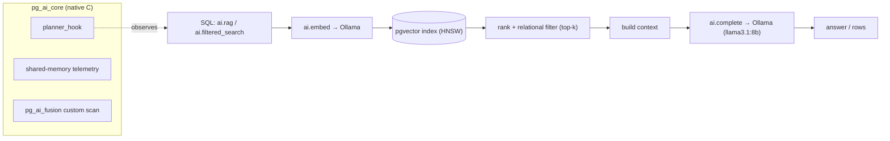

# PostgreSQL AI Edition — `pg_ai`

[](https://github.com/devjamez/postgresql-ai-edition/actions/workflows/ci.yml)

### AI inside PostgreSQL — embeddings, semantic search, RAG & agents, callable from SQL. No API key. No second database. One `docker compose up`.

Your embeddings live next to your data (ACID, JOINs, Row-Level Security). Inference runs **locally via Ollama** — no key, nothing leaves the host. A native C extension makes the **engine itself AI-aware**. Stop syncing a separate vector DB — delete the box from your diagram. → [**Why in-database**](#why-in-database-the-technical-case)

Runs on **standard PostgreSQL 16/17** — it's a pure extension, no fork. (Deep C internals are a later, surgical step — see [ADR-0001](docs-ai/ADR-0001-extension-vs-fork.md).)

## What you get

```sql
-- semantic search
WITH q AS (SELECT ai.embed('notebook para desarrollo de IA') AS v)
SELECT nombre FROM productos ORDER BY embedding <=> (SELECT v FROM q) LIMIT 3;

-- RAG, grounded in your own tables
SELECT ai.rag('¿Qué laptop me conviene para IA?', 'productos', 'descripcion', 'embedding');

-- agents with memory
SELECT ai.create_agent('asesor', 'Sos un asesor de compras. Respondé corto.');
SELECT ai.call_agent('asesor', 'busco una laptop para programar');
```

**→ See [docs-ai/DEMO.md](docs-ai/DEMO.md) for real output** (semantic search, RAG, agent memory, filtered fusion).

## Architecture



Everything runs **inside PostgreSQL**. The thin layer (`pg_ai`) orchestrates a local model via PL/Python; `pg_ai_core` integrates with the engine in C. No external service, no API key.

## Why in-database? (the technical case)

The classic AI stack keeps **two datastores** — your relational PostgreSQL *and* a vector DB — plus orchestration glue in the app. `pg_ai` collapses that into one. What you gain, concretely:

1. **One source of truth (ACID).** The embedding is a `vector` column next to the row it describes, updated in the *same transaction*. No dual-write, no re-sync jobs, no consistency drift between two systems.
2. **Semantic search composes with SQL.** `JOIN` + relational filter + vector ordering + transaction in a single query — instead of "query the vector DB → fetch IDs → query Postgres → filter in app". `ai.filter_ann` + adaptive over-fetch even return the correct top-k under selective filters (the pre/post-filter problem).
3. **Security for free.** Roles, `GRANT`, and **Row-Level Security** apply to `ai.rag`/`ai.filtered_search` — multi-tenant isolation with no authorization logic duplicated in an external service.
4. **The engine is AI-aware.** `pg_ai_core` (C) hooks the planner and adds a custom scan, so a `WHERE … ORDER BY emb <=> $1 LIMIT k` is optimized transparently — integration at the engine level, not a wrapper.
5. **Agent runtime inside the DB.** Agents, memory, tools, workflows and a background worker (queue + scheduling) are transactional, backed by normal `pg_dump`/PITR and streaming replication — no separate stateful service.
6. **Fewer moving parts.** Local inference (Ollama, no API key) keeps data on the host, and you operate **one system you already run** — one backup, one HA story, one monitoring model.

**Honest trade-offs:** a dedicated vector DB shards further at extreme scale, and managed PostgreSQL (RDS/Cloud SQL) usually can't load `plpython3u` (so the AI layer needs self-managed PG). For the vast majority of apps already on Postgres, removing the second system is less complexity, not more. More in [docs-ai/05-ai-storage.md](docs-ai/05-ai-storage.md).

## Requirements

- **Docker Desktop** (the only thing you must install). Tested on **PostgreSQL 16 and 17**.
- **~8 GB of free RAM** — the generation model runs locally on your machine.

> No API key and no GPU required: inference runs locally via Ollama (`nomic-embed-text` + `llama3.1:8b`). An optional Anthropic key enables Claude-generated answers (`ai.complete_claude`). A smaller model (e.g. `llama3.2`) works if RAM is tight — set `AI_CHAT_MODEL` in `docker-compose.yml`.

## Quickstart

```bash
# 1. build & start (first run pulls images + compiles the container)
docker compose up -d --build

# 2. pull the local models, one time (~5 GB; embeddings + generation)
docker compose exec -T ollama ollama pull nomic-embed-text
docker compose exec -T ollama ollama pull llama3.1:8b

# 3. extensions auto-install on first boot (sql/00_init.sql runs
#    CREATE EXTENSION pg_ai CASCADE + pg_ai_core). To install manually elsewhere:
#    psql> CREATE EXTENSION pg_ai CASCADE;   -- pulls in vector + plpython3u
#    psql> CREATE EXTENSION pg_ai_core;       -- native C planner pilot

# 4. run the demo
docker compose exec -T db psql -U postgres -d pgai < examples/demo.sql
```

Prefer a prebuilt image instead of building locally? Pull it from GHCR:
`docker pull ghcr.io/devjamez/postgresql-ai-edition:latest` (or `:pg17`).

Reset only the database (keeps the downloaded models):
`docker compose rm -fs db && docker volume rm postgresqlaiedition_pgai_data && docker compose up -d db`

## SQL surface

| Function | Purpose |
|---|---|
| `ai.embed(text) -> vector` | Embedding (Ollama `nomic-embed-text`, 768d) |
| `ai.embed_batch(text[]) -> vector[]` | Embed many texts in one HTTP call |
| `ai.embedding_dim() -> int` | Dimension of the current embedding model |
| `ai.health() -> jsonb` | Provider reachability, models present, config (revoked from PUBLIC) |
| `ai.complete(prompt, system, model) -> text` | Completion via Ollama (`llama3.1:8b`) |
| `ai.complete_claude(prompt, system, model, max_tokens) -> text` | Completion via Anthropic (optional) |
| `ai.similarity(a, b) -> float` | Cosine similarity in [0,1] |
| `ai.semantic_match(emb, query, threshold) -> bool` | Convenience predicate (small tables only) |
| `ai.rag(question, table, content_col, emb_col, k, model) -> text` | Retrieval-augmented answer |
| `ai.filter_ann(emb, table, content_col, emb_col, filters jsonb, k) -> setof` | Filtered ANN: safe equality filters (jsonb) + vector order + top-k (adaptive over-fetch) |
| `ai.filtered_search(query, table, content_col, emb_col, filters jsonb, k) -> setof` | `ai.filter_ann` with the query embedded for you |
| `ai.filter_ann_raw(emb, table, content_col, emb_col, predicate, k) -> setof` | Advanced: raw SQL predicate (**trusted input only**; revoked from PUBLIC) |
| `ai.chunk(doc, max_chars, overlap) -> setof text` | Split a long document into overlapping windows for embedding |
| `ai.search_mmr(emb, table, content_col, emb_col, k, fetch_n, lambda_weight) -> setof` | MMR reranking: relevance vs. diversity (no model call) |
| `ai.create_agent(name, system_prompt, model) -> int` | Register an agent |
| `ai.call_agent(name, message) -> text` | Call an agent (with memory) |
| `ai.register_tool(name, desc, handler regprocedure)` / `ai.run_tool(name, arg)` | Register a SQL `text->text` function as a tool / run it |
| `ai.call_agent_tools(agent, message, max_steps) -> text` | Agent loop that can call registered tools (ReAct) |
| `ai.register_workflow(name, steps jsonb)` / `ai.run_workflow(name, input)` | Multi-step pipeline (`tool`/`complete`/`rag`), output chains to next |
| `ai.audit` table + `SET pg_ai.audit = on` | Opt-in log of completions (model, prompt, response, latency) |
| `ai.rerank(query, table, content_col, emb_col, k, fetch_n) -> setof` | LLM reranker (listwise): retrieve by ANN, then the model orders the top-k |
| `ai.submit_task/submit_tool/submit_workflow(target, input, run_at)` + `ai.task_status/task_result(id)` | Async (optionally delayed) agent/tool/workflow runs via a queue drained by the `pg_ai_core` background worker |
| `ai.schedule(name, kind, target, input, period, first_run)` / `ai.unschedule(name)` | Recurring scheduled runs (cron-like); the worker fires due schedules each wake |

Catalog: `ai.models`, `ai.agents`, `ai.agent_memory`.

## Security

- The default setup uses local Ollama and needs **no API key**. Any optional key (e.g. Anthropic) lives only in the **server environment** (`.env` → container env) — never in SQL, never in the repo. `.env` is gitignored.
- **Filters are injection-safe**: `ai.filter_ann`/`ai.filtered_search` take a `jsonb` of equality conditions, escaped via `format %I/%L`. Raw SQL predicates are isolated in `ai.filter_ann_raw` (trusted input only).
- **Deny-by-default**: `EXECUTE` on the network/raw functions (`ai.embed`, `ai.embed_batch`, `ai.complete*`, `ai.filter_ann_raw`) is revoked from `PUBLIC`; grant to trusted roles deliberately.
- `ai.embed`/`ai.complete*` use the **untrusted** `plpython3u` language → only superusers can create them; grant `EXECUTE` deliberately.
- Treat any text sent to `ai.complete`/`ai.rag` as untrusted input (prompt-injection surface). See [docs-ai/TESTING.md](docs-ai/TESTING.md) and the roadmap.

## V2 pilot — native C engine integration (`pg_ai_core`)

Beyond the SQL/Python thin layer, `pg_ai_core/` is a **compiled C extension** that integrates with PostgreSQL internals — the first step toward "intelligence inside the engine":

- Installs a **`planner_hook`** that intercepts AI-semantic queries at plan time (the mechanism for future relational + vector plan fusion).
- Keeps **cluster-wide telemetry in shared memory**: how many statements are planned vs. how many are AI-semantic.
- Provides a **Custom Scan provider** (`pg_ai_fusion`) registered via `set_rel_pathlist_hook` — the executable foundation for relational + vector plan fusion (see [docs-ai/RFC-0001](docs-ai/RFC-0001-v2-plan-fusion.md)). Opt-in per session:

```sql
SELECT pg_ai_core_version();
SELECT * FROM pg_ai_core_stats();   -- planned | ai_intercepted | fusion_candidates
SELECT pg_ai_core_reset();

SET pg_ai_core.fuse = on;           -- route base-table scans through the fusion node
EXPLAIN SELECT * FROM docs WHERE category = 'x';   -- Custom Scan (pg_ai_fusion)
```

It is built during the Docker image build (`postgresql-server-dev-16` + PGXS) and loaded via `shared_preload_libraries=pg_ai_core`.

**Status — M1 done, M2 transparent auto-apply done (opt-in):** filtered ANN (relational filter + vector order + top-k with adaptive over-fetch) ships as `ai.filter_ann` / `ai.filtered_search` (see [`examples/filtered_search.sql`](examples/filtered_search.sql)), built on pgvector's `hnsw.iterative_scan` — no engine fork. With `SET pg_ai_core.auto_fuse = on`, the `ExecutorStart` hook **transparently** applies that to a plain `WHERE … ORDER BY emb <=> $1 LIMIT k` (transaction-local, auto-reverts, no leak). Remaining V2 work (filter inside the HNSW graph walk for recall; native types) is documented in [docs-ai/RFC-0001](docs-ai/RFC-0001-v2-plan-fusion.md).

## Docs

- [**Knowledge base index**](docs-ai/README.md) · [**Master Architecture**](docs-ai/MASTER-ARCHITECTURE.md)
- [Demo — real output](docs-ai/DEMO.md)
- [Architecture phases (FASE 1–12)](docs-ai/README.md#phases) — design docs grounded in the shipped code
- [FASE 1 — Anatomy of PostgreSQL 16](docs-ai/01-postgresql-anatomy.md)
- [ADR-0001 — Extension vs. Fork](docs-ai/ADR-0001-extension-vs-fork.md)
- [RFC-0001 — V2 relational+vector plan fusion](docs-ai/RFC-0001-v2-plan-fusion.md)
- [RFC-0002 — Filtered HNSW (M2-recall) + partial-index recipe](docs-ai/RFC-0002-filtered-hnsw.md)
- [Testing plan](docs-ai/TESTING.md)
- [Publishing plan](docs-ai/PUBLISHING.md)
- [Master architecture prompt](docs-ai/00-master-prompt.md)

## License

[PostgreSQL License](LICENSE). Open source, free to use and modify.
