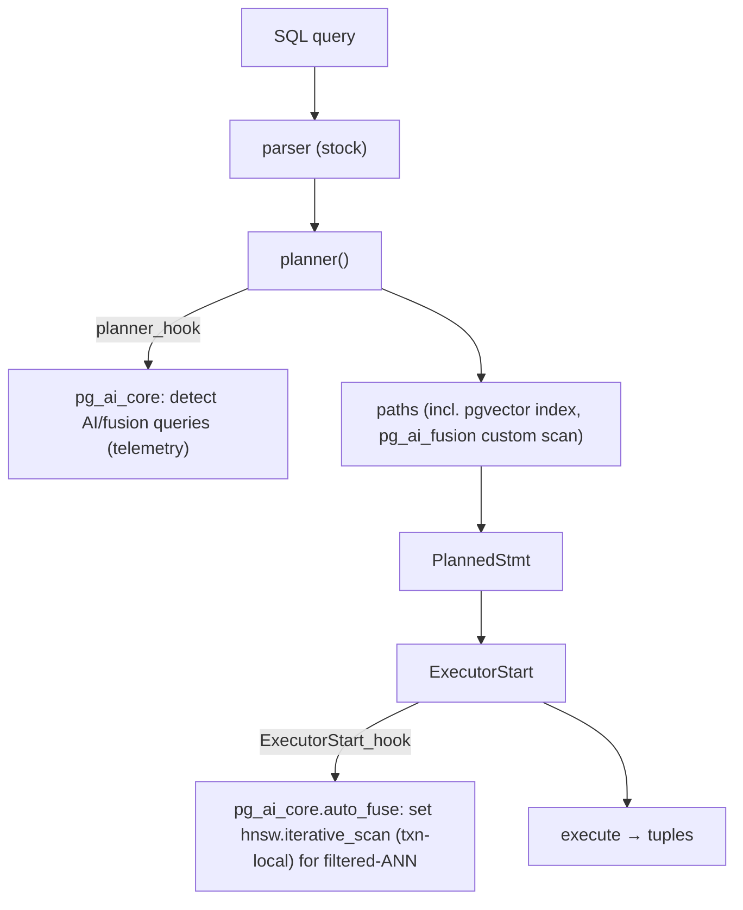

# FASE 4 — AI Planner

How `pg_ai` makes the engine *aware* of AI queries without forking the parser/planner. Full design + source citations in [RFC-0001](RFC-0001-v2-plan-fusion.md) and [RFC-0002](RFC-0002-filtered-hnsw.md).

## Architecture

## What's built (`pg_ai_core`, native C)

- **`planner_hook`** — observes AI-semantic and filtered-ANN queries; cluster-wide telemetry in shared memory (`pg_ai_core_stats()`). ✅
- **`set_rel_pathlist_hook` + Custom Scan** (`pg_ai_fusion`) — an executable plan-node foundation; opt-in via `pg_ai_core.fuse`. ✅
- **`ExecutorStart_hook` (auto_fuse)** — transparently enables iterative ANN scans for the filtered-ANN pattern, transaction-local (auto-reverts, no leak). ✅ (M2)

## Advantages
- No parser/planner fork → 100% compatibility, survives PG upgrades.
- Hooks are a supported, stable API ([FASE 1](01-postgresql-anatomy.md) §5).
- Telemetry gives a data-driven basis for deeper investment.

## Risks / limits
- Hooks observe and nudge; they don't rewrite core cost decisions.
- True predicate-pushdown into the ANN walk needs pgvector internals — research-grade, see [RFC-0002](RFC-0002-filtered-hnsw.md).
- A custom scan must be cost-calibrated to be chosen (`STD_FUZZ_FACTOR` 1.01).

## Compatibility
Everything here is an extension loaded via `shared_preload_libraries=pg_ai_core`; removing it returns the engine to stock behavior.
