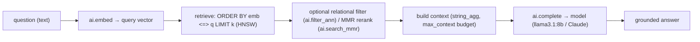

# FASE 8 — RAG Engine

Retrieval-augmented generation that runs entirely inside the database.

## Flow (as implemented)



## Surface

```sql
-- one call: retrieve top-k from a table + answer, grounded
SELECT ai.rag('How do I train models?', 'docs', 'chunk', 'embedding', k => 5);

-- ingestion → RAG (examples/ingestion.sql): chunk → embed_batch → search → MMR → rag
```

## What's built
- `ai.rag(question, table, content_col, emb_col, k, model, max_context)` — full retrieve→context→generate, with a **context-size budget** (`max_context`) so prompts stay bounded. ✅
- `ai.chunk()` — overlapping windows for ingesting long documents. ✅
- `ai.search_mmr()` — MMR reranking to diversify retrieved context (relevance vs. redundancy). ✅
- Filtered retrieval — `ai.filter_ann` / `auto_fuse` so RAG respects relational predicates. ✅

## Design notes / gaps
- **Retrieval quality knobs** present: top-k, MMR `lambda_weight`, chunk size/overlap, context budget.
- **Deferred:** cross-encoder reranking (needs a reranker model), citations/provenance in the answer, streaming responses, multi-hop RAG. All are additive on top of the current functions.
- **In-engine** by design: no application-tier RAG glue; the whole loop is one SQL call, transactional, close to the data.
