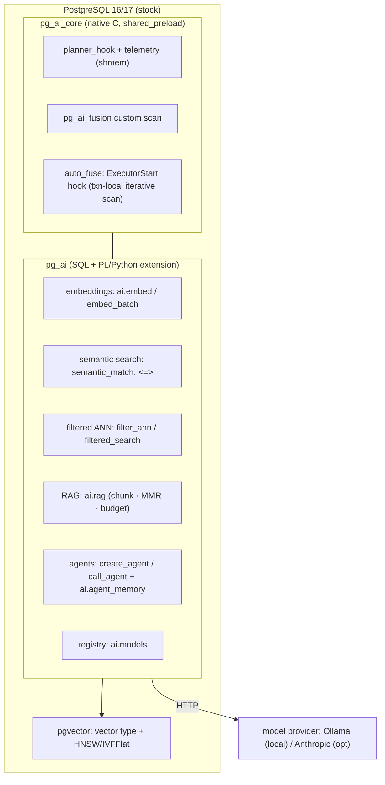

# PostgreSQL AI Edition — Master Architecture

The capstone document: the vision, the one decision that shaped everything, what actually shipped, and how the pieces fit. Companion to the phase docs (see [Knowledge Base index](README.md)).

## Vision

Evolve PostgreSQL for the AI era: store relational data, documents and embeddings, and run semantic search, RAG and agents **inside the engine** — keeping maximum PostgreSQL compatibility. Not another vector DB; not a wrapper. An AI-capable edition of Postgres.

## The decision that shaped everything (ADR-0001)

**Extension-first, fork-never-unless-justified.** A fork of the C core (native grammar/types) would deliver the deepest integration but breaks upstream compatibility and costs years. So `pg_ai` delivers the *full AI surface* as an extension on stock PostgreSQL, and touches the engine in C only through **supported seams** (hooks, index AM, background workers, shared memory) — never the parser. This is the through-line of every phase.

## System at a glance

## What shipped (V1, releases v0.1.0–v0.5.1)

- **Data**: embeddings as `vector` columns (pgvector), documents/memory as relations — transactional, replicated, RLS-able. ([FASE 5](05-ai-storage.md))
- **Surface**: `ai.embed/embed_batch`, `ai.complete/complete_claude`, `ai.similarity/semantic_match`, `ai.filter_ann/filtered_search/filter_ann_raw`, `ai.rag`, `ai.chunk`, `ai.search_mmr`, `ai.create_agent/call_agent`, `ai.embedding_dim`, `ai.health`. ([FASE 2](02-ai-components.md), [FASE 3](03-semantic-sql.md))
- **Engine integration** (`pg_ai_core`, C): planner hook + shared-memory telemetry + Custom Scan + transparent `auto_fuse`. ([FASE 4](04-ai-planner.md))
- **Indexes**: HNSW/IVFFlat + over-fetch + partial-index pushdown. ([FASE 6](06-ai-indexes.md))
- **RAG & agents**: in-engine retrieve→rerank→generate; agents with memory. ([FASE 8](08-rag-engine.md), [FASE 9](09-agent-engine.md))
- **Security**: injection-safe filters, deny-by-default RBAC, local-inference-by-default, secrets in env only. ([FASE 10](10-ai-security.md))
- **Ops**: Docker + GHCR image, CI on PG 16/17, smoke suite, health/telemetry, PGXN-packaged. ([FASE 11](11-ai-cloud.md))

## What's designed, not built (honest)

- **Runtime depth** (V2): tools, workflows, async agents → background-worker + task-queue design ([FASE 7](07-ai-runtime.md)/[9](09-agent-engine.md)); per-call audit; MCP.
- **Engine depth** (V3): in-walk filtered ANN ([RFC-0002](RFC-0002-filtered-hnsw.md)), cost model, native types — team/upstream, with a recall-test bar; deliberately not shipped blind.
- **Platform** (V4/V5): K8s/operator, multi-region, managed/governance. ([FASE 12](12-roadmap.md))

## Why this is the right shape

Locality + compatibility. Embeddings live next to the rows they describe, so AI composes with joins/transactions/RLS, and it runs on the Postgres you already operate — no dual datastore, no fork to maintain. The deep-engine ambitions remain reachable *along the same supported interfaces*, documented in the RFCs, gated on the resources they genuinely require.

> Single source of truth for the code: the [main README](../README.md) and the extension SQL under `pg_ai/` and `pg_ai_core/`. This document and the phase docs explain the *why*; the code is the *what*.
